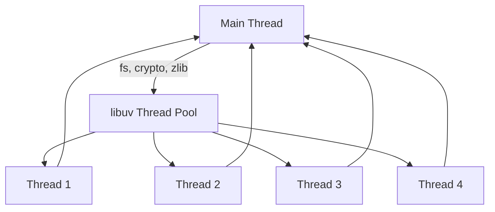
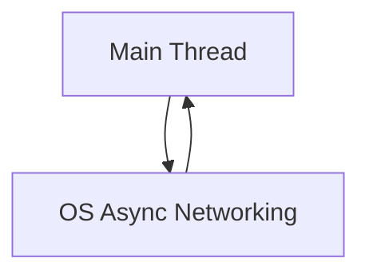
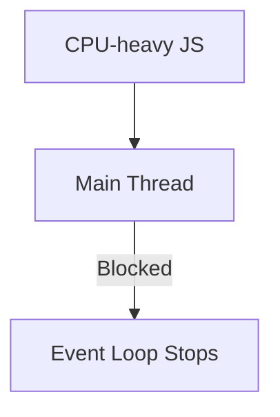
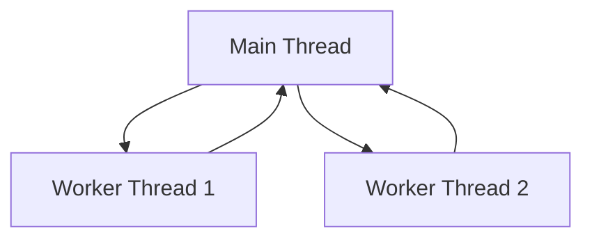

Got it 👍
Here is **ONE single, complete `README.md` file** that explains **Node.js execution end-to-end** — **JavaScript execution, event loop, libuv, thread pool, I/O vs CPU tasks, networking, worker threads** — all in **one place**, with **GitHub-renderable Mermaid diagrams**.

You can **copy–paste this directly** into `README.md`.

---

````md
# 🚀 Node.js Execution Model – Complete Guide

This document explains **how Node.js executes code internally**, including:
- JavaScript execution
- Event loop
- libuv
- Thread pool
- I/O-bound vs CPU-bound tasks
- Networking
- Worker threads

Designed for **GitHub rendering** with **Mermaid diagrams**.

---

## 1️⃣ What is Node.js?

- Node.js is a **JavaScript runtime** built on **V8**
- JavaScript execution is **single-threaded**
- Node.js is optimized for **I/O-bound workloads**
- Uses **event-driven, non-blocking architecture**

---

## 2️⃣ JavaScript Execution (Main Thread)

- All **JavaScript code runs on ONE main thread**
- This thread:
  - Executes JS
  - Runs the **event loop**
- Synchronous JS executes **one task at a time**

```mermaid
sequenceDiagram
    participant MT as Main Thread
    MT->>MT: Execute JS line by line
    MT->>MT: Execute next task
````

---

## 3️⃣ High-Level Node.js Architecture

```mermaid
flowchart TD
    JS[JavaScript Code] --> MT[Main Thread]
    MT --> EL[Event Loop]

    EL -->|Async I/O| LUV[libuv]
    LUV --> TP[Thread Pool]
    LUV --> OS[OS Async APIs]

    TP --> Q[Callback Queue]
    OS --> Q
    Q --> EL
```

---

## 4️⃣ The Event Loop (Simplified)

The event loop decides **when callbacks can run**.


The event loop **runs on the main thread**.

---

## 5️⃣ What is libuv?

* libuv is a **C library** used by Node.js
* Handles:

  * Async I/O
  * Thread pool
  * Event loop internals
* Prevents blocking the JS thread

---

## 6️⃣ libuv Thread Pool

* Default size: **4 threads**
* Configurable via:

```bash
UV_THREADPOOL_SIZE=8
```



### Uses Thread Pool:

* File system (`fs`)
* Crypto (`crypto`)
* Compression (`zlib`)
* DNS (some operations)

---

## 7️⃣ Networking (No Thread Pool)

Networking uses **OS async socket APIs**, not the thread pool.



Examples:

* HTTP
* HTTPS
* TCP
* WebSockets

---

## 8️⃣ CPU-Heavy JavaScript (Blocking)

**CPU-heavy = pure JavaScript computation**

Examples:

* Large loops
* Complex calculations
* Data processing
* JSON parsing (huge data)



### While blocked:

* ❌ No requests handled
* ❌ No callbacks
* ❌ No promises
* ❌ No timers

---

## 9️⃣ I/O-bound vs CPU-bound Tasks

| Task Type           | Where It Runs     | Blocks Event Loop |
| ------------------- | ----------------- | ----------------- |
| Pure JS computation | Main thread       | ✅ Yes             |
| File I/O            | libuv thread pool | ❌ No              |
| Crypto / zlib       | libuv thread pool | ❌ No              |
| DNS                 | libuv / OS        | ❌ No              |
| Networking          | OS async APIs     | ❌ No              |

---

## 🔟 Worker Threads (CPU Parallelism)

To handle CPU-heavy work **without blocking**, use worker threads.



✔ True parallel execution
✔ Best solution for CPU-bound tasks

---

## 1️⃣1️⃣ Why Node.js is Fast

✔ Non-blocking I/O
✔ Event-driven
✔ Efficient for high concurrency
✔ Minimal memory usage

---

## 1️⃣2️⃣ Why Node.js Can Feel Slow

❌ CPU-heavy JS blocks the event loop
❌ Single-threaded JS execution
❌ Long-running sync code stops everything

---

## 🎯 Final Summary

> **Node.js executes JavaScript on a single main thread.
> I/O-bound operations are handled asynchronously via libuv and OS APIs,
> while CPU-heavy JavaScript blocks the event loop unless worker threads are used.
> This makes Node.js ideal for I/O-heavy applications but unsuitable for CPU-intensive workloads without parallelization.**

---

## ⭐ Notes

* GitHub **natively supports Mermaid diagrams**
* Works in:

  * README.md
  * GitHub Wiki
  * Markdown documentation

---

Happy coding 🚀

```

---

If you want next:
- ✅ **Interview-only condensed version**
- ✅ **Code examples mapped to each diagram**
- ✅ **Advanced event loop deep dive**
- ✅ **Performance tuning checklist**

Just say 👍
::contentReference[oaicite:0]{index=0}
```
